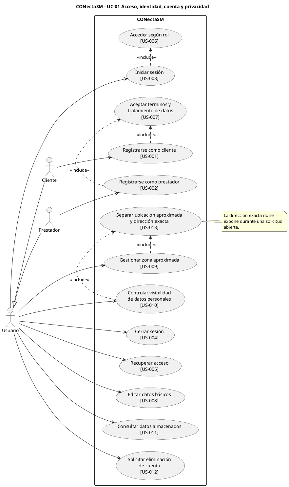
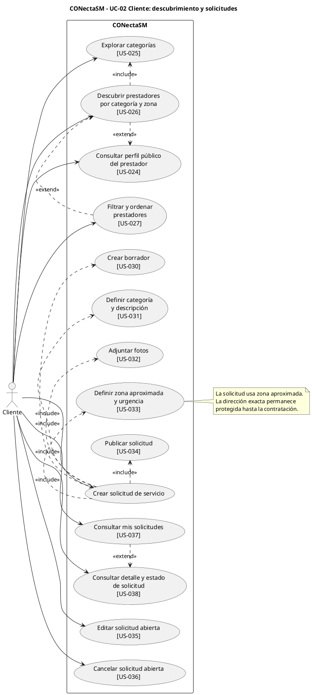
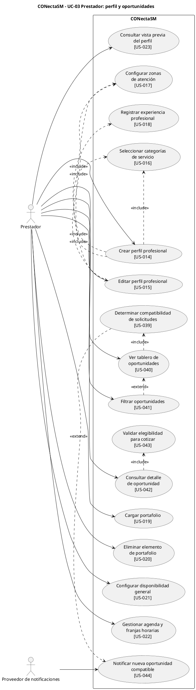
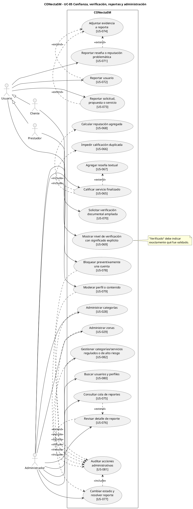
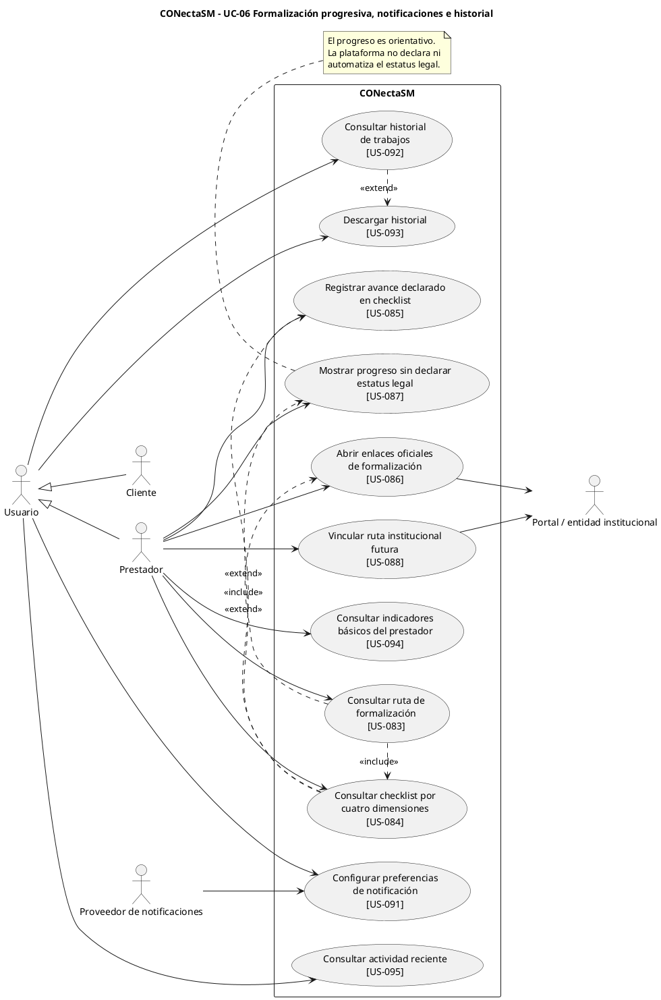
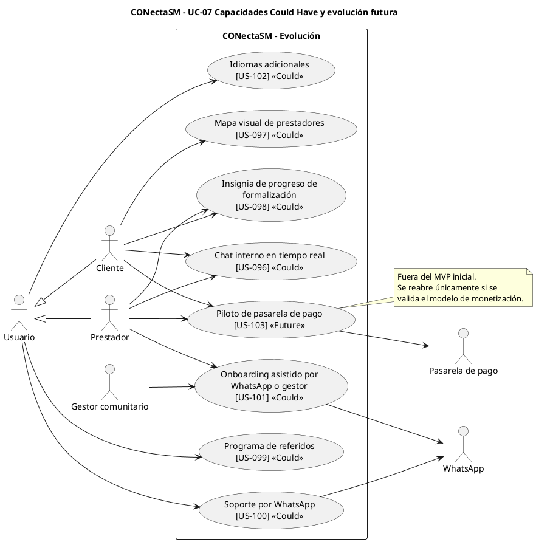

# Diagramas de casos de uso 

## 1. Actores identificados

| Actor | Responsabilidad principal |
|---|---|
| **Cliente** | Buscar prestadores, publicar solicitudes, comparar propuestas, contratar, gestionar el servicio, calificar y reportar. |
| **Prestador** | Construir su perfil, recibir oportunidades, cotizar, ejecutar servicios, construir reputación y consultar su ruta de formalización. |
| **Administrador** | Gestionar catálogos, moderación, reportes, bloqueos y auditoría. |
| **Proveedor de notificaciones** | Entregar avisos asociados a oportunidades, propuestas y cambios de estado. |
| **Portal / entidad institucional** | Destino externo para rutas y enlaces oficiales de formalización. |
| **Gestor comunitario / WhatsApp / Pasarela de pago** | Actores externos asociados a capacidades Could/Future. |

## 2. División recomendada

| Diagrama | Alcance                                   |
| -------- | ----------------------------------------- |
| UC-01    | Acceso, cuenta y privacidad               |
| UC-02    | Cliente: descubrimiento y solicitudes     |
| UC-03    | Prestador: perfil y oportunidades         |
| UC-04    | Propuestas, contratación y servicio       |
| UC-05    | Confianza, reportes y administración      |
| UC-06    | Formalización, notificaciones e historial |
| UC-07    | Capacidades Could/Future                  |

---

## UC-01 — Acceso, identidad, cuenta y privacidad

## UC-02 — Cliente: descubrimiento y solicitudes

## UC-03 — Prestador: perfil y oportunidades

## UC-04 — Propuestas, contratación y ciclo de vida

```plantuml
@startuml
title CONectaSM - UC-04 Propuestas, contratación y ciclo de vida del servicio
left to right direction
skinparam packageStyle rectangle
skinparam shadowing false

actor "Cliente" as Cliente
actor "Prestador" as Prestador
actor "Proveedor de notificaciones" as Notif

rectangle "CONectaSM" {
  usecase "Crear propuesta\n[US-045]" as UC045
  usecase "Definir precio o rango\n[US-046]" as UC046
  usecase "Indicar disponibilidad\n[US-047]" as UC047
  usecase "Agregar mensaje\n[US-048]" as UC048
  usecase "Editar propuesta activa\n[US-049]" as UC049
  usecase "Retirar propuesta\n[US-050]" as UC050
  usecase "Notificar propuesta recibida\n[US-051]" as UC051

  usecase "Consultar propuestas\nrecibidas\n[US-052]" as UC052
  usecase "Comparar propuestas\ny perfiles\n[US-053]" as UC053
  usecase "Aceptar propuesta\n[US-054]" as UC054
  usecase "Cerrar propuestas\nno seleccionadas\n[US-055]" as UC055

  usecase "Crear registro de\nservicio contratado\n[US-056]" as UC056
  usecase "Habilitar datos de\ncoordinación\n[US-057]" as UC057
  usecase "Consultar detalle\ndel servicio\n[US-058]" as UC058
  usecase "Marcar servicio\nen ejecución\n[US-059]" as UC059
  usecase "Marcar trabajo\ncomo terminado\n[US-060]" as UC060
  usecase "Confirmar finalización\n[US-061]" as UC061
  usecase "Cancelar servicio\ncontratado\n[US-062]" as UC062
  usecase "Consultar historial\nde estados\n[US-063]" as UC063
  usecase "Usar canal de coordinación\nautorizado\n[US-064]" as UC064

  usecase "Notificar aceptación\nde propuesta\n[US-089]" as UC089
  usecase "Notificar cambios de estado\ndel servicio\n[US-090]" as UC090
}

Prestador --> UC045
Prestador --> UC049
Prestador --> UC050
Prestador --> UC058
Prestador --> UC059
Prestador --> UC060
Prestador --> UC062
Prestador --> UC063
Prestador --> UC064

Cliente --> UC052
Cliente --> UC053
Cliente --> UC054
Cliente --> UC058
Cliente --> UC061
Cliente --> UC062
Cliente --> UC063
Cliente --> UC064

UC045 .> UC046 : <<include>>
UC045 .> UC047 : <<include>>
UC045 .> UC048 : <<include>>
UC045 .> UC051 : <<include>>

UC052 .> UC053 : <<extend>>
UC054 .> UC055 : <<include>>
UC054 .> UC056 : <<include>>
UC054 .> UC057 : <<include>>
UC054 .> UC089 : <<include>>
UC057 .> UC064 : <<include>>

UC059 .> UC090 : <<include>>
UC060 .> UC090 : <<include>>
UC061 .> UC090 : <<include>>
UC062 .> UC090 : <<include>>

Notif --> UC051
Notif --> UC089
Notif --> UC090

note bottom of UC064
El canal concreto depende de la
decisión de producto: chat interno,
teléfono tras aceptación o WhatsApp.
end note
@enduml
```

## UC-05 — Confianza, verificación, reportes y administración

## UC-06 — Formalización progresiva, notificaciones e historial

## UC-07 — Evolución futura

