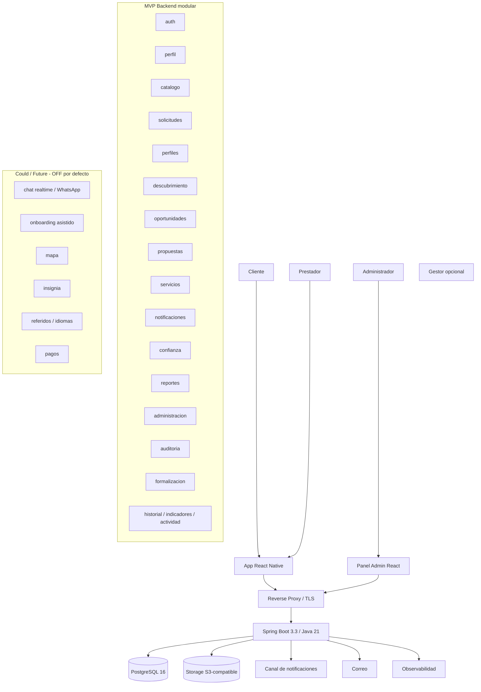
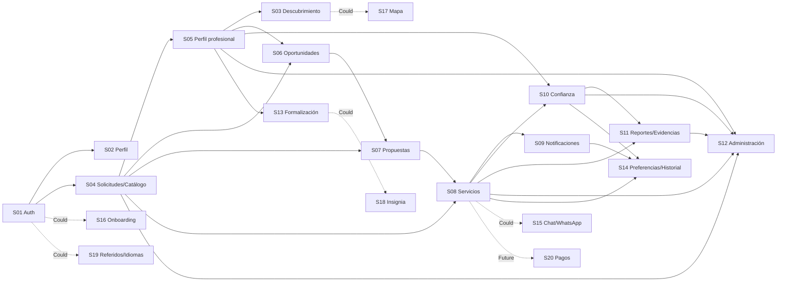
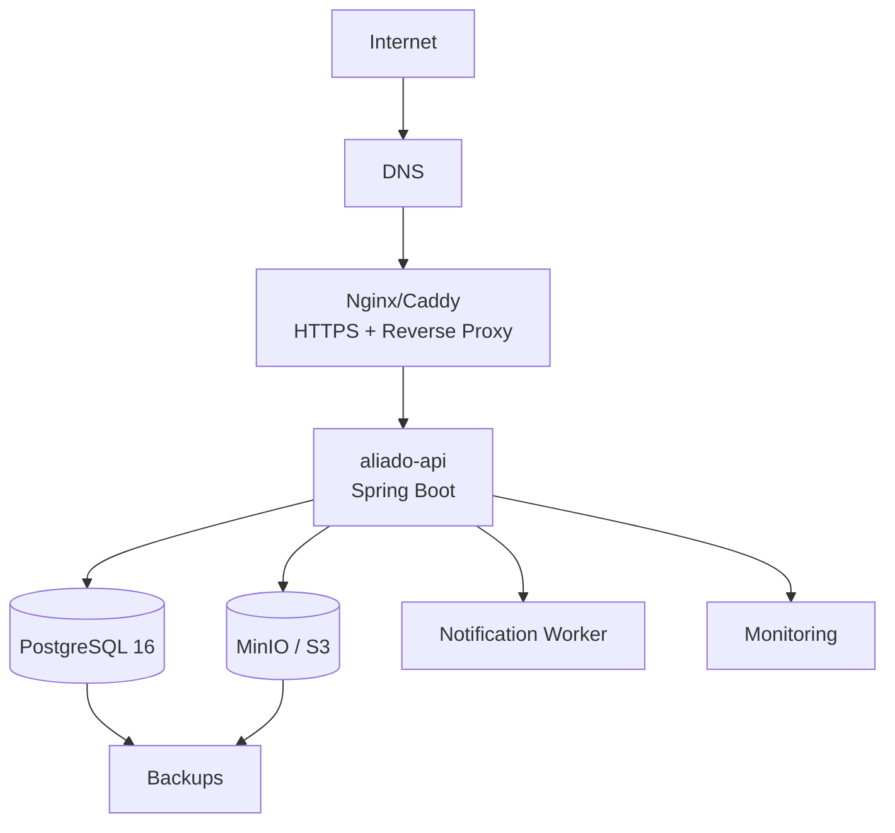
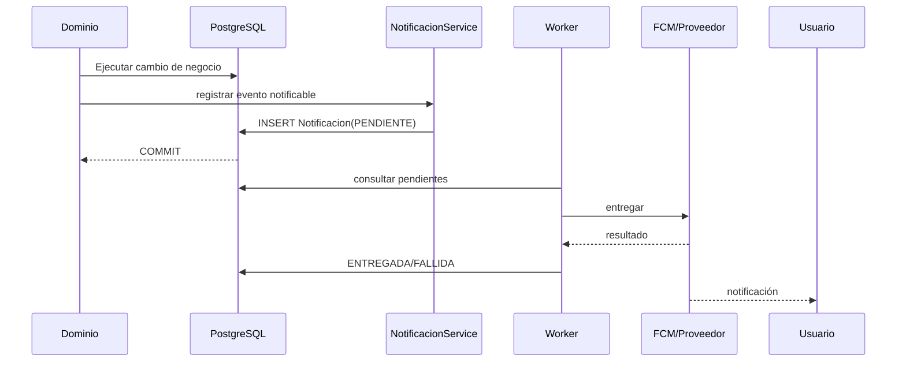
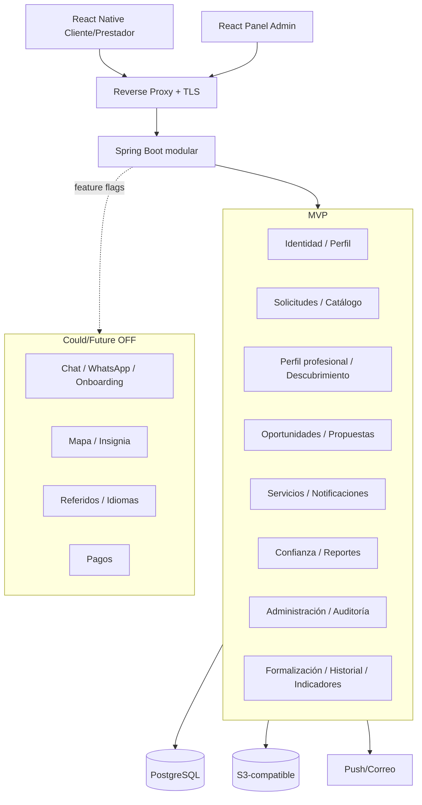

# PLAN GENERAL DE IMPLEMENTACIÓN E INFRAESTRUCTURA — ALIADO

**Proyecto:** ALIADO - Plataforma para la gestión y contratación confiable de servicios técnicos a domicilio en Santa Marta  
**Programa:** Ingeniería de Sistemas - Universidad del Magdalena  
**Periodo:** 2026-2  
**Fecha del plan general:** 2026-10-02  


---

## 1. Propósito del documento

Este documento consolida en un único plan técnico la arquitectura, infraestructura, módulos, dependencias, datos, seguridad, despliegue, pruebas y orden de implementación de ALIADO para el alcance completo actualmente especificado en los SPEC-01 a SPEC-20.

El objetivo no es reemplazar los planes individuales de cada SPEC. Los planes individuales siguen siendo la fuente de detalle para sus historias, endpoints y tareas; este documento define la **visión integral del sistema** y las decisiones transversales necesarias para que todas las piezas evolucionen de forma coherente.

La solución se organiza como un **monolito modular**, con un backend único consumido por una aplicación móvil React Native para Cliente/Prestador y un panel web React para Administración. La persistencia principal es PostgreSQL y el despliegue inicial se realiza mediante contenedores Docker sobre VPS.

---

## 2. Contexto y objetivo de ingeniería

ALIADO busca reducir la fragmentación actual de la gestión de servicios técnicos a domicilio en Santa Marta. El diseño consolidado de SPEC-01 a SPEC-20 cubre el ciclo principal del marketplace, la capa de confianza y administración, y capacidades Could/Future desacopladas.

El sistema debe permitir que:

- un Cliente se registre, gestione su privacidad, descubra Prestadores y publique solicitudes;
- un Prestador gestione perfil profesional, portafolio, disponibilidad y agenda;
- el sistema calcule oportunidades compatibles y permita presentar propuestas;
- un Cliente acepte una propuesta y se materialice un `ServicioContratado`;
- Cliente y Prestador gestionen de forma trazable el ciclo de vida del servicio;
- el sistema emita notificaciones derivadas de eventos reales;
- un Cliente califique un servicio finalizado y el sistema derive reputación;
- un Prestador pueda solicitar verificación documental ampliada;
- usuarios puedan reportar reseñas, cuentas o servicios y adjuntar evidencia;
- Administradores mantengan catálogos, moderen contenido, resuelvan reportes y apliquen controles preventivos;
- Prestadores consulten una ruta orientativa de formalización sin que ALIADO certifique estatus legal;
- usuarios gestionen preferencias, historial, actividad reciente e indicadores autorizados;
- capacidades Could/Future permanezcan aisladas y deshabilitadas hasta aprobación explícita.

### 2.1 Usuarios principales

| Actor | Responsabilidad principal |
|---|---|
| Cliente | Descubrir Prestadores, publicar solicitudes, comparar propuestas, contratar, gestionar servicios, calificar y reportar |
| Prestador | Mantener perfil, disponibilidad, oportunidades, propuestas, ejecución, reputación y formalización orientativa |
| Administrador | Catálogos, cola de reportes, moderación, bloqueos, riesgo, auditoría y revisión administrativa |
| Gestor comunitario | Actor externo opcional para onboarding asistido; no sustituye autenticación ni reglas de privacidad |

### 2.2 Clasificación de alcance

- **MVP / núcleo y confianza**: SPEC-01 a SPEC-14, con las capacidades Future internas de SPEC-13 deshabilitadas.
- **Could**: SPEC-15 a SPEC-19; todas deshabilitadas por defecto mediante feature flags.
- **Future**: SPEC-20; inaccesible hasta validar modelo de monetización y registrar aprobación explícita.

## 3. Alcance consolidado

### 3.1 Mapa completo de SPEC y módulos

| SPEC | Módulo / bounded context                                | Capacidad                                              | Alcance                          |
| ---- | ------------------------------------------------------- | ------------------------------------------------------ | -------------------------------- |
| 01   | `auth`                                                  | Registro, autenticación, sesión, recuperación, roles   | MVP                              |
| 02   | `perfil`                                                | Datos personales, privacidad, ubicación, eliminación   | MVP                              |
| 03   | `descubrimiento`                                        | Buscar Prestadores y perfil público                    | MVP                              |
| 04   | `solicitudes` + `catalogo`                              | Solicitudes, fotos, catálogos base, storage            | MVP                              |
| 05   | `perfiles`                                              | Perfil profesional, portafolio, disponibilidad, agenda | MVP                              |
| 06   | `oportunidades`                                         | Compatibilidad, tablero, oportunidades                 | MVP                              |
| 07   | `propuestas`                                            | Crear, editar, retirar propuestas                      | MVP                              |
| 08   | `servicios`                                             | Contratación, estados, historial, canal autorizado     | MVP                              |
| 09   | `notificaciones`                                        | Aceptación y cambios de estado                         | MVP                              |
| 10   | `confianza` + núcleo `reportes`                         | Calificaciones, reseñas, reputación, verificación      | MVP                              |
| 11   | `reportes`                                              | Reportar usuario/servicio y evidencia                  | MVP                              |
| 12   | `administracion` + `auditoria`                          | Catálogos, moderación, bloqueos, riesgo                | MVP                              |
| 13   | `formalizacion`                                         | Ruta y progreso orientativo                            | MVP + integración Future apagada |
| 14   | `preferencias`, `historial`, `indicadores`, `actividad` | Preferencias, historial, exportación, métricas         | MVP                              |
| 15   | `comunicacion.realtime` + `soporte`                     | Chat interno y WhatsApp                                | Could                            |
| 16   | `onboarding`                                            | Acompañamiento humano                                  | Could                            |
| 17   | `descubrimiento.mapa`                                   | Mapa aproximado de Prestadores                         | Could                            |
| 18   | `formalizacion.insignia`                                | Insignia derivada de progreso                          | Could                            |
| 19   | `referidos` + `internacionalizacion`                    | Referidos e idiomas                                    | Could                            |
| 20   | `pagos`                                                 | Piloto de pasarela                                     | Future                           |

### 3.2 Regla de alcance

Las capacidades Could/Future deben cumplir simultáneamente:

1. feature flag deshabilitada por defecto;
2. ausencia de dependencias bloqueantes desde módulos MVP;
3. ninguna UI del MVP debe asumir su disponibilidad;
4. sus tablas/adapters no pueden convertirse en fuente de verdad del flujo principal;
5. activación únicamente mediante decisión documentada.

## 4. Principios arquitectónicos

1. **Monolito modular antes que microservicios.**  
   La escala del piloto no justifica la complejidad operacional de microservicios. Los dominios se separan por paquetes y contratos internos.

2. **Una sola fuente de verdad por concepto.**  
   `Solicitud`, `PerfilProfesional`, `Propuesta`, `ServicioContratado` y `Notificacion` no deben duplicarse en otros módulos.

3. **Dependencias explícitas entre dominios.**  
   Los módulos consumen servicios o interfaces públicas de otros módulos en lugar de acceder arbitrariamente a sus tablas.

4. **Privacidad por diseño.**  
   La dirección exacta y los datos de contacto no forman parte de DTO públicos.

5. **Cambios de estado transaccionales.**  
   Toda transición crítica debe quedar en la misma transacción que su registro de historial y evento persistente asociado.

6. **Idempotencia en operaciones sensibles.**  
   Reintentos causados por conectividad débil no deben duplicar solicitudes, propuestas, servicios ni notificaciones.

7. **Infraestructura sustituible mediante interfaces.**  
   Archivos, notificaciones y otros proveedores externos se abstraen detrás de contratos internos.

8. **Observabilidad desde el inicio.**  
   Logs estructurados, métricas, health checks y trazabilidad de errores forman parte de la infraestructura base.

9. **Optimización para móvil y conectividad intermitente.**  
   Las APIs deben tolerar reintentos, payloads moderados y paginación.

10. **Evolución incremental.**  
    Las capacidades futuras se añaden como módulos sin modificar de manera destructiva el núcleo del MVP.

---

## 5. Arquitectura de alto nivel



**Decisión macro**: monolito modular desplegado como una unidad para el piloto. Los límites anteriores son límites de dominio/código, no microservicios.

## 6. Decisiones tecnológicas consolidadas

### 6.1 Tecnologías base confirmadas por los planes

| Capa | Tecnología |
|---|---|
| Lenguaje backend | Java 21 LTS |
| Framework backend | Spring Boot 3.3.x |
| API | REST/JSON |
| Persistencia | PostgreSQL 16 |
| ORM | Spring Data JPA / Hibernate |
| Migraciones | Flyway |
| Seguridad | Spring Security + BCrypt |
| Validación | Spring Validation |
| Build | Maven |
| Unit testing | JUnit 5 + Mockito |
| Integration testing | Spring Boot Test + Testcontainers |
| Contract/API testing | MockMvc o WebTestClient |
| App móvil | React Native |
| Panel administrativo | React |
| Contenedores | Docker |
| Orquestación inicial | Docker Compose |
| Plataforma inicial | VPS |

### 6.2 Decisiones propuestas por este plan general

Estas decisiones cierran vacíos identificados expresamente en los SPEC y deberán ratificarse antes de implementación productiva.

#### Sesiones

**Decisión propuesta:** usar **token opaco de sesión** generado criptográficamente y almacenado únicamente como hash en la tabla `sesiones`.

Razones:

- el modelo de SPEC-01 ya define `Sesion.tokenHash`;
- facilita revocación inmediata;
- evita mantener JWT activos imposibles de invalidar antes de expirar;
- simplifica logout y control de sesión para el piloto.

El cliente recibe el token en el login y lo envía mediante:

```http
Authorization: Bearer <opaque-session-token>
```

#### Almacenamiento de archivos

**Decisión propuesta:** contrato `ArchivoStorageService` con backend S3-compatible.

Implementación por entorno:

- desarrollo: MinIO local;
- piloto en VPS: MinIO o proveedor S3-compatible externo;
- evolución: cualquier servicio compatible con S3 sin cambiar la lógica del dominio.

El sistema persiste únicamente metadata/URL/clave de objeto, nunca blobs binarios dentro de PostgreSQL.

#### Notificaciones

**Decisión propuesta:** unificar SPEC-06, SPEC-07 y SPEC-09 bajo el módulo genérico `notificaciones`.

Modelo objetivo:

- `Notificacion`
- `EventoNotificable`/clave de idempotencia
- `CanalEntregaNotificacion`
- adaptador push
- adaptador de correo si aplica

Durante la transición pueden mantenerse las tablas puntuales existentes, pero no deben convertirse en el patrón definitivo.

**Canal principal propuesto para la app:** push móvil mediante Firebase Cloud Messaging.  
**Canal secundario:** correo para recuperación de acceso y eventos que requieran respaldo.

#### Entrega confiable de eventos

Para evitar que una transacción de negocio quede acoplada a la disponibilidad de FCM/correo, se adopta:

- persistencia atómica de la notificación dentro de la transacción de negocio;
- entrega asíncrona posterior;
- reintentos con backoff;
- clave de idempotencia;
- estado `PENDIENTE`, `ENTREGADA`, `FALLIDA`.

Para una evolución futura, este mecanismo puede formalizarse como **Transactional Outbox** sin introducir un broker externo en el MVP.

---

## 7. Estructura lógica del repositorio

ALIADO se implementará como un **monolito modular**, donde cada dominio funcional constituye un módulo independiente dentro del backend y, a su vez, cada módulo mantiene separación interna por capas.

La organización general sigue el principio:

```
módulo/
├── controller/     # Entrada HTTP / API REST
├── service/        # Casos de uso y lógica de aplicación
├── repository/     # Acceso a persistencia
├── model/          # Entidades y objetos de dominio
├── dto/            # Contratos de entrada/salida
├── mapper/         # Conversión Entity ↔ DTO, cuando sea necesaria
└── exception/      # Excepciones propias del módulo, cuando aplique
```

No todos los módulos están obligados a poseer todas las carpetas. Solo deben crearse cuando exista una responsabilidad real asociada.

```
aliado/
│
├── backend/
│   │
│   ├── pom.xml
│   │
│   ├── Dockerfile
│   │
│   ├── .dockerignore
│   │
│   │
│   ├── src/
│   │   │
│   │   ├── main/
│   │   │   │
│   │   │   ├── java/
│   │   │   │   └── com/
│   │   │   │       └── aliado/
│   │   │   │
│   │   │   │           ├── AliadoApplication.java
│   │   │   │           │
│   │   │   │           ├── auth/
│   │   │   │           │   ├── controller/
│   │   │   │           │   │   └── AuthController.java
│   │   │   │           │   ├── service/
│   │   │   │           │   │   ├── AuthService.java
│   │   │   │           │   │   ├── RegistroService.java
│   │   │   │           │   │   ├── SesionService.java
│   │   │   │           │   │   └── RecuperacionAccesoService.java
│   │   │   │           │   ├── repository/
│   │   │   │           │   │   ├── UsuarioRepository.java
│   │   │   │           │   │   ├── ConsentimientoRepository.java
│   │   │   │           │   │   ├── SesionRepository.java
│   │   │   │           │   │   └── TokenRecuperacionRepository.java
│   │   │   │           │   ├── model/
│   │   │   │           │   │   ├── Usuario.java
│   │   │   │           │   │   ├── Consentimiento.java
│   │   │   │           │   │   ├── Sesion.java
│   │   │   │           │   │   ├── TokenRecuperacion.java
│   │   │   │           │   │   └── RolUsuario.java
│   │   │   │           │   ├── dto/
│   │   │   │           │   │   ├── RegistroRequest.java
│   │   │   │           │   │   ├── LoginRequest.java
│   │   │   │           │   │   ├── LoginResponse.java
│   │   │   │           │   │   └── RecuperacionRequest.java
│   │   │   │           │   └── mapper/
│   │   │   │           │
│   │   │   │           ├── perfil/
│   │   │   │           │   ├── controller/
│   │   │   │           │   ├── service/
│   │   │   │           │   │   ├── PerfilUsuarioService.java
│   │   │   │           │   │   ├── UbicacionService.java
│   │   │   │           │   │   └── EliminacionCuentaService.java
│   │   │   │           │   ├── repository/
│   │   │   │           │   ├── model/
│   │   │   │           │   │   ├── PerfilUsuario.java
│   │   │   │           │   │   ├── Ubicacion.java
│   │   │   │           │   │   └── SolicitudEliminacion.java
│   │   │   │           │   ├── dto/
│   │   │   │           │   └── mapper/
│   │   │   │           │
│   │   │   │           ├── catalogo/
│   │   │   │           │   ├── controller/
│   │   │   │           │   │   └── CatalogoController.java
│   │   │   │           │   ├── service/
│   │   │   │           │   │   └── CatalogoService.java
│   │   │   │           │   ├── repository/
│   │   │   │           │   │   ├── CategoriaServicioRepository.java
│   │   │   │           │   │   └── ZonaRepository.java
│   │   │   │           │   ├── model/
│   │   │   │           │   │   ├── CategoriaServicio.java
│   │   │   │           │   │   └── Zona.java
│   │   │   │           │   ├── dto/
│   │   │   │           │   └── mapper/
│   │   │   │           │
│   │   │   │           ├── solicitudes/
│   │   │   │           │   ├── controller/
│   │   │   │           │   │   └── SolicitudController.java
│   │   │   │           │   ├── service/
│   │   │   │           │   │   ├── SolicitudService.java
│   │   │   │           │   │   └── FotoSolicitudService.java
│   │   │   │           │   ├── repository/
│   │   │   │           │   │   ├── SolicitudRepository.java
│   │   │   │           │   │   ├── FotoSolicitudRepository.java
│   │   │   │           │   │   └── HistorialEstadoSolicitudRepository.java
│   │   │   │           │   ├── model/
│   │   │   │           │   │   ├── Solicitud.java
│   │   │   │           │   │   ├── FotoSolicitud.java
│   │   │   │           │   │   ├── HistorialEstadoSolicitud.java
│   │   │   │           │   │   ├── EstadoSolicitud.java
│   │   │   │           │   │   └── UrgenciaSolicitud.java
│   │   │   │           │   ├── dto/
│   │   │   │           │   └── mapper/
│   │   │   │           │
│   │   │   │           ├── perfiles/
│   │   │   │           │   ├── controller/
│   │   │   │           │   │   └── PerfilProfesionalController.java
│   │   │   │           │   ├── service/
│   │   │   │           │   │   ├── PerfilProfesionalService.java
│   │   │   │           │   │   ├── ExperienciaProfesionalService.java
│   │   │   │           │   │   ├── PortafolioService.java
│   │   │   │           │   │   ├── DisponibilidadService.java
│   │   │   │           │   │   └── AgendaService.java
│   │   │   │           │   ├── repository/
│   │   │   │           │   ├── model/
│   │   │   │           │   │   ├── PerfilProfesional.java
│   │   │   │           │   │   ├── PerfilCategoria.java
│   │   │   │           │   │   ├── PerfilZonaAtencion.java
│   │   │   │           │   │   ├── ExperienciaProfesional.java
│   │   │   │           │   │   ├── ServicioPortafolio.java
│   │   │   │           │   │   ├── Disponibilidad.java
│   │   │   │           │   │   └── CompromisoAgenda.java
│   │   │   │           │   ├── dto/
│   │   │   │           │   │   ├── PerfilProfesionalRequest.java
│   │   │   │           │   │   ├── PerfilProfesionalResponse.java
│   │   │   │           │   │   └── PerfilPublicoResponse.java
│   │   │   │           │   └── mapper/
│   │   │   │           │
│   │   │   │           ├── descubrimiento/
│   │   │   │           │   ├── controller/
│   │   │   │           │   ├── service/
│   │   │   │           │   │   └── DescubrimientoService.java
│   │   │   │           │   ├── dto/
│   │   │   │           │   ├── mapper/
│   │   │   │           │   └── mapa/                  # SPEC-17 Could
│   │   │   │           │       ├── controller/
│   │   │   │           │       ├── service/
│   │   │   │           │       └── dto/
│   │   │   │           │
│   │   │   │           ├── oportunidades/
│   │   │   │           │   ├── controller/
│   │   │   │           │   ├── service/
│   │   │   │           │   │   └── CompatibilidadService.java
│   │   │   │           │   ├── dto/
│   │   │   │           │   │   ├── OportunidadResponse.java
│   │   │   │           │   │   └── FiltroOportunidadesRequest.java
│   │   │   │           │   └── mapper/
│   │   │   │           │
│   │   │   │           ├── propuestas/
│   │   │   │           │   ├── controller/
│   │   │   │           │   ├── service/
│   │   │   │           │   │   └── PropuestaService.java
│   │   │   │           │   ├── repository/
│   │   │   │           │   │   └── PropuestaRepository.java
│   │   │   │           │   ├── model/
│   │   │   │           │   │   ├── Propuesta.java
│   │   │   │           │   │   └── EstadoPropuesta.java
│   │   │   │           │   ├── dto/
│   │   │   │           │   └── mapper/
│   │   │   │           │
│   │   │   │           ├── servicios/
│   │   │   │           │   ├── controller/
│   │   │   │           │   │   └── ServicioController.java
│   │   │   │           │   ├── service/
│   │   │   │           │   │   ├── ServicioService.java
│   │   │   │           │   │   ├── EstadoServicioService.java
│   │   │   │           │   │   └── ComunicacionServicioService.java
│   │   │   │           │   ├── repository/
│   │   │   │           │   │   ├── ServicioContratadoRepository.java
│   │   │   │           │   │   ├── HistorialEstadoServicioRepository.java
│   │   │   │           │   │   └── MensajeServicioRepository.java
│   │   │   │           │   ├── model/
│   │   │   │           │   │   ├── ServicioContratado.java
│   │   │   │           │   │   ├── HistorialEstadoServicio.java
│   │   │   │           │   │   ├── MensajeServicio.java
│   │   │   │           │   │   └── EstadoServicio.java
│   │   │   │           │   ├── dto/
│   │   │   │           │   └── mapper/
│   │   │   │           │
│   │   │   │           ├── notificaciones/
│   │   │   │           │   ├── controller/
│   │   │   │           │   ├── service/
│   │   │   │           │   │   ├── NotificacionService.java
│   │   │   │           │   │   ├── EntregaNotificacionService.java
│   │   │   │           │   │   └── ReintentoNotificacionService.java
│   │   │   │           │   ├── repository/
│   │   │   │           │   │   └── NotificacionRepository.java
│   │   │   │           │   ├── model/
│   │   │   │           │   │   ├── Notificacion.java
│   │   │   │           │   │   ├── TipoNotificacion.java
│   │   │   │           │   │   └── EstadoEntrega.java
│   │   │   │           │   ├── gateway/
│   │   │   │           │   │   ├── CanalEntregaNotificacion.java
│   │   │   │           │   │   ├── PushNotificationGateway.java
│   │   │   │           │   │   └── EmailNotificationGateway.java
│   │   │   │           │   └── dto/
│   │   │   │           │
│   │   │   │           ├── confianza/
│   │   │   │           │   ├── controller/
│   │   │   │           │   │   ├── CalificacionController.java
│   │   │   │           │   │   ├── ConfianzaController.java
│   │   │   │           │   │   └── VerificacionController.java
│   │   │   │           │   ├── service/
│   │   │   │           │   │   ├── CalificacionService.java
│   │   │   │           │   │   ├── ReputacionService.java
│   │   │   │           │   │   └── VerificacionService.java
│   │   │   │           │   ├── repository/
│   │   │   │           │   ├── model/
│   │   │   │           │   │   ├── Calificacion.java
│   │   │   │           │   │   ├── Resena.java
│   │   │   │           │   │   ├── ReputacionPrestador.java
│   │   │   │           │   │   ├── SolicitudVerificacion.java
│   │   │   │           │   │   └── DocumentoVerificacion.java
│   │   │   │           │   ├── dto/
│   │   │   │           │   └── mapper/
│   │   │   │           │
│   │   │   │           ├── reportes/
│   │   │   │           │   ├── controller/
│   │   │   │           │   ├── service/
│   │   │   │           │   │   ├── ReporteService.java
│   │   │   │           │   │   └── EvidenciaReporteService.java
│   │   │   │           │   ├── repository/
│   │   │   │           │   │   ├── ReporteRepository.java
│   │   │   │           │   │   └── EvidenciaReporteRepository.java
│   │   │   │           │   ├── model/
│   │   │   │           │   │   ├── Reporte.java
│   │   │   │           │   │   ├── EvidenciaReporte.java
│   │   │   │           │   │   ├── TipoReporte.java
│   │   │   │           │   │   └── EstadoReporte.java
│   │   │   │           │   ├── dto/
│   │   │   │           │   └── mapper/
│   │   │   │           │
│   │   │   │           ├── administracion/
│   │   │   │           │   ├── controller/
│   │   │   │           │   │   ├── CatalogoAdminController.java
│   │   │   │           │   │   ├── ReporteAdminController.java
│   │   │   │           │   │   ├── CuentaAdminController.java
│   │   │   │           │   │   ├── ModeracionController.java
│   │   │   │           │   │   └── RiesgoController.java
│   │   │   │           │   ├── service/
│   │   │   │           │   │   ├── AdministracionCatalogoService.java
│   │   │   │           │   │   ├── ModeracionService.java
│   │   │   │           │   │   ├── BloqueoService.java
│   │   │   │           │   │   ├── RiesgoService.java
│   │   │   │           │   │   └── BusquedaAdminService.java
│   │   │   │           │   ├── repository/
│   │   │   │           │   ├── model/
│   │   │   │           │   │   ├── BloqueoPreventivo.java
│   │   │   │           │   │   ├── AccionModeracion.java
│   │   │   │           │   │   └── MarcaAltoRiesgo.java
│   │   │   │           │   ├── dto/
│   │   │   │           │   └── mapper/
│   │   │   │           │
│   │   │   │           ├── auditoria/
│   │   │   │           │   ├── controller/
│   │   │   │           │   │   └── AuditoriaController.java
│   │   │   │           │   ├── service/
│   │   │   │           │   │   └── AuditoriaService.java
│   │   │   │           │   ├── repository/
│   │   │   │           │   ├── model/
│   │   │   │           │   │   └── AuditoriaAdministrativa.java
│   │   │   │           │   └── dto/
│   │   │   │           │
│   │   │   │           ├── formalizacion/
│   │   │   │           │   ├── controller/
│   │   │   │           │   ├── service/
│   │   │   │           │   │   ├── RutaFormalizacionService.java
│   │   │   │           │   │   ├── ProgresoFormalizacionService.java
│   │   │   │           │   │   └── VinculacionInstitucionalService.java
│   │   │   │           │   ├── repository/
│   │   │   │           │   ├── model/
│   │   │   │           │   │   ├── RutaFormalizacion.java
│   │   │   │           │   │   ├── PasoFormalizacion.java
│   │   │   │           │   │   ├── EnlaceInstitucional.java
│   │   │   │           │   │   └── ProgresoFormalizacion.java
│   │   │   │           │   ├── dto/
│   │   │   │           │   ├── mapper/
│   │   │   │           │   └── insignia/             # SPEC-18 Could
│   │   │   │           │       ├── service/
│   │   │   │           │       └── dto/
│   │   │   │           │
│   │   │   │           ├── preferencias/
│   │   │   │           │   ├── controller/
│   │   │   │           │   ├── service/
│   │   │   │           │   ├── repository/
│   │   │   │           │   ├── model/
│   │   │   │           │   │   └── PreferenciaNotificacion.java
│   │   │   │           │   └── dto/
│   │   │   │           │
│   │   │   │           ├── historial/
│   │   │   │           │   ├── controller/
│   │   │   │           │   ├── service/
│   │   │   │           │   │   ├── HistorialService.java
│   │   │   │           │   │   └── ExportacionHistorialService.java
│   │   │   │           │   ├── model/
│   │   │   │           │   │   └── DescargaHistorial.java
│   │   │   │           │   └── dto/
│   │   │   │           │
│   │   │   │           ├── indicadores/
│   │   │   │           │   ├── controller/
│   │   │   │           │   ├── service/
│   │   │   │           │   │   └── IndicadorService.java
│   │   │   │           │   └── dto/
│   │   │   │           │       └── IndicadorBasicoResponse.java
│   │   │   │           │
│   │   │   │           ├── actividad/
│   │   │   │           │   ├── controller/
│   │   │   │           │   ├── service/
│   │   │   │           │   │   └── ActividadRecienteService.java
│   │   │   │           │   └── dto/
│   │   │   │           │
│   │   │   │           ├── comunicacion/             # Could — SPEC-15
│   │   │   │           │   └── realtime/
│   │   │   │           │       ├── config/
│   │   │   │           │       ├── gateway/
│   │   │   │           │       └── service/
│   │   │   │           │
│   │   │   │           ├── soporte/                  # Could — SPEC-15
│   │   │   │           │   ├── controller/
│   │   │   │           │   ├── service/
│   │   │   │           │   ├── repository/
│   │   │   │           │   └── model/
│   │   │   │           │
│   │   │   │           ├── onboarding/               # Could — SPEC-16
│   │   │   │           │   ├── controller/
│   │   │   │           │   ├── service/
│   │   │   │           │   ├── repository/
│   │   │   │           │   ├── model/
│   │   │   │           │   └── dto/
│   │   │   │           │
│   │   │   │           ├── referidos/                # Could — SPEC-19
│   │   │   │           │   ├── controller/
│   │   │   │           │   ├── service/
│   │   │   │           │   ├── repository/
│   │   │   │           │   ├── model/
│   │   │   │           │   └── dto/
│   │   │   │           │
│   │   │   │           ├── internacionalizacion/     # Could — SPEC-19
│   │   │   │           │   ├── controller/
│   │   │   │           │   ├── service/
│   │   │   │           │   ├── repository/
│   │   │   │           │   ├── model/
│   │   │   │           │   └── dto/
│   │   │   │           │
│   │   │   │           ├── pagos/                    # Future — SPEC-20
│   │   │   │           │   ├── controller/
│   │   │   │           │   │   ├── PagoPilotoController.java
│   │   │   │           │   │   └── PagoWebhookController.java
│   │   │   │           │   ├── service/
│   │   │   │           │   │   ├── PagoPilotoService.java
│   │   │   │           │   │   └── ReconciliacionPagoService.java
│   │   │   │           │   ├── gateway/
│   │   │   │           │   │   └── PasarelaPago.java
│   │   │   │           │   ├── repository/
│   │   │   │           │   ├── model/
│   │   │   │           │   └── dto/
│   │   │   │           │
│   │   │   │           └── common/
│   │   │   │               ├── config/
│   │   │   │               │   ├── JacksonConfig.java
│   │   │   │               │   └── ApplicationConfig.java
│   │   │   │               ├── security/
│   │   │   │               │   ├── SecurityConfig.java
│   │   │   │               │   ├── AuthenticationFilter.java
│   │   │   │               │   ├── AuthorizationService.java
│   │   │   │               │   └── CurrentUser.java
│   │   │   │               ├── exception/
│   │   │   │               │   ├── GlobalExceptionHandler.java
│   │   │   │               │   ├── BusinessException.java
│   │   │   │               │   └── ApiError.java
│   │   │   │               ├── storage/
│   │   │   │               │   ├── ArchivoStorageService.java
│   │   │   │               │   ├── S3ArchivoStorageAdapter.java
│   │   │   │               │   └── StorageProperties.java
│   │   │   │               ├── featureflags/
│   │   │   │               │   ├── FeatureFlagService.java
│   │   │   │               │   └── FeatureFlagsProperties.java
│   │   │   │               ├── idempotency/
│   │   │   │               │   ├── IdempotencyService.java
│   │   │   │               │   └── IdempotencyFilter.java
│   │   │   │               ├── observability/
│   │   │   │               │   ├── TraceIdFilter.java
│   │   │   │               │   └── MetricsConfig.java
│   │   │   │               ├── pagination/
│   │   │   │               │   └── PageResponse.java
│   │   │   │               └── validation/
│   │   │   │                   └── ValidationUtils.java
│   │   │   │
│   │   │   └── resources/
│   │   │       ├── application.yml
│   │   │       ├── application-dev.yml
│   │   │       ├── application-test.yml
│   │   │       ├── application-prod.yml
│   │   │       │
│   │   │       └── db/
│   │   │           └── migration/
│   │   │               ├── V001__auth.sql
│   │   │               ├── V002__perfil_privacidad.sql
│   │   │               ├── V003__catalogo.sql
│   │   │               ├── V004__solicitudes.sql
│   │   │               ├── V005__perfil_profesional.sql
│   │   │               ├── V006__propuestas.sql
│   │   │               ├── V007__servicios.sql
│   │   │               ├── V008__notificaciones.sql
│   │   │               ├── V009__confianza.sql
│   │   │               ├── V010__reportes.sql
│   │   │               ├── V011__administracion.sql
│   │   │               ├── V012__formalizacion.sql
│   │   │               └── V013__preferencias_historial.sql
│   │   │
│   │   └── test/
│   │       └── java/
│   │           └── com/
│   │               └── aliado/
│   │                   ├── contract/
│   │                   │   ├── auth/
│   │                   │   ├── perfil/
│   │                   │   ├── solicitudes/
│   │                   │   ├── perfiles/
│   │                   │   ├── descubrimiento/
│   │                   │   ├── oportunidades/
│   │                   │   ├── propuestas/
│   │                   │   ├── servicios/
│   │                   │   ├── notificaciones/
│   │                   │   ├── confianza/
│   │                   │   ├── reportes/
│   │                   │   └── administracion/
│   │                   │
│   │                   ├── integration/
│   │                   │   ├── auth/
│   │                   │   ├── solicitudes/
│   │                   │   ├── perfiles/
│   │                   │   ├── propuestas/
│   │                   │   ├── servicios/
│   │                   │   ├── confianza/
│   │                   │   ├── reportes/
│   │                   │   ├── administracion/
│   │                   │   └── formalizacion/
│   │                   │
│   │                   ├── unit/
│   │                   │   ├── auth/
│   │                   │   ├── solicitudes/
│   │                   │   ├── oportunidades/
│   │                   │   ├── propuestas/
│   │                   │   ├── servicios/
│   │                   │   ├── confianza/
│   │                   │   ├── reportes/
│   │                   │   ├── indicadores/
│   │                   │   └── common/
│   │                   │
│   │                   └── support/
│   │                       ├── TestDataFactory.java
│   │                       ├── PostgreSQLContainerConfig.java
│   │                       └── SecurityTestUtils.java
│   │
│   └── README.md
│
├── app-movil/
│   ├── package.json
│   ├── app.json
│   ├── src/
│   │   ├── modules/
│   │   │   ├── auth/
│   │   │   ├── perfil/
│   │   │   ├── solicitudes/
│   │   │   ├── descubrimiento/
│   │   │   ├── oportunidades/
│   │   │   ├── propuestas/
│   │   │   ├── servicios/
│   │   │   ├── confianza/
│   │   │   ├── reportes/
│   │   │   ├── formalizacion/
│   │   │   ├── historial/
│   │   │   └── preferencias/
│   │   ├── navigation/
│   │   ├── components/
│   │   ├── services/
│   │   │   ├── api/
│   │   │   ├── storage/
│   │   │   └── notifications/
│   │   ├── hooks/
│   │   ├── store/
│   │   ├── theme/
│   │   └── utils/
│   └── tests/
│
├── panel-admin/
│   ├── package.json
│   ├── src/
│   │   ├── modules/
│   │   │   ├── auth/
│   │   │   ├── dashboard/
│   │   │   ├── categorias/
│   │   │   ├── zonas/
│   │   │   ├── reportes/
│   │   │   ├── usuarios/
│   │   │   ├── moderacion/
│   │   │   ├── riesgos/
│   │   │   ├── verificaciones/
│   │   │   └── auditoria/
│   │   ├── components/
│   │   ├── services/
│   │   ├── hooks/
│   │   ├── routes/
│   │   ├── store/
│   │   └── utils/
│   └── tests/
│
├── infra/
│   ├── docker/
│   │   ├── backend/
│   │   ├── postgres/
│   │   └── storage/
│   ├── reverse-proxy/
│   │   ├── Caddyfile
│   │   └── nginx.conf
│   ├── monitoring/
│   │   ├── prometheus/
│   │   └── grafana/
│   ├── backup/
│   │   ├── backup-postgres.sh
│   │   ├── restore-postgres.sh
│   │   └── backup-storage.sh
│   └── scripts/
│       ├── deploy.sh
│       ├── rollback.sh
│       └── smoke-test.sh
│
├── docs/
│   ├── architecture/
│   │   ├── diagrams/
│   │   ├── decisions/
│   │   │   ├── ADR-001-monolito-modular.md
│   │   │   ├── ADR-002-sesiones-opacas.md
│   │   │   ├── ADR-003-storage-s3.md
│   │   │   ├── ADR-004-notificaciones.md
│   │   │   └── ADR-005-feature-flags.md
│   │   └── data-model/
│   ├── api/
│   │   └── openapi/
│   ├── security/
│   ├── operations/
│   │   ├── deployment.md
│   │   ├── backup-restore.md
│   │   └── incident-response.md
│   └── testing/
│
├── .github/
│   └── workflows/
│       ├── backend-ci.yml
│       ├── mobile-ci.yml
│       ├── admin-ci.yml
│       └── deploy.yml
│
├── .env.example
├── .gitignore
├── docker-compose.yml
├── docker-compose.prod.yml
└── README.md
```

### 7.1 Criterio de organización modular

La unidad principal de organización del backend es el **dominio funcional**, no la capa global.

Por tanto, se utiliza:

```
auth/
├── controller/
├── service/
├── repository/
├── model/
└── dto/

solicitudes/
├── controller/
├── service/
├── repository/
├── model/
└── dto/
```

y se evita una estructura global de este tipo:

```
controller/
├── AuthController
├── SolicitudController
├── PropuestaController
└── ...

service/
├── AuthService
├── SolicitudService
└── ...
```

La organización por módulo mantiene juntas las clases que cambian por la misma razón y reduce el acoplamiento entre funcionalidades.

### 7.2 Responsabilidad de las capas

|Capa|Responsabilidad|
|---|---|
|`controller/`|API REST, validación superficial del request, códigos HTTP|
|`service/`|casos de uso, reglas de negocio, transacciones y coordinación entre módulos|
|`repository/`|persistencia y consultas|
|`model/`|entidades JPA, enums y objetos propios del dominio|
|`dto/`|contratos públicos de entrada y salida|
|`mapper/`|transformación entre modelo y DTO cuando aporte claridad|
|`gateway/`|contrato con proveedores o infraestructura externa|
|`exception/`|errores específicos del dominio cuando no pertenecen a `common`|

### 7.3 Regla para comunicación entre módulos

Un módulo no debe acceder directamente a los repositorios internos de otro módulo.

Incorrecto:

```
PropuestaService
    ↓
SolicitudRepository
```

Preferido:

```
PropuestaService
    ↓
SolicitudService / SolicitudQueryService
    ↓
SolicitudRepository
```

De esta forma:

```
propuestas
    │
    └── depende del contrato de solicitudes

solicitudes
    │
    └── conserva el control de su persistencia
```

Esto permite mantener el monolito modular preparado para una eventual extracción futura sin diseñar prematuramente microservicios.

### 7.4 `common` no es un dominio

`common/` debe contener exclusivamente infraestructura realmente transversal:

```
security
storage
idempotency
observability
featureflags
exception
pagination
validation
config
```

No deben moverse hacia `common/` servicios o modelos simplemente porque sean utilizados por dos módulos.

Por ejemplo:

```
CategoriaServicio
```

permanece en:

```
catalogo/model/
```

aunque sea utilizada por Solicitudes, Perfiles, Descubrimiento y Administración.

### 7.5 Módulos sin persistencia propia

No todos los módulos requieren `repository/` o `model/`.

Ejemplos:

```
descubrimiento/
oportunidades/
indicadores/
actividad/
```

son principalmente **read models o servicios de cálculo**, por lo que pueden depender de entidades de otros módulos sin crear tablas redundantes.

Particularmente:

```
Oportunidad != entidad persistente
```

sino una proyección calculada de:

```
Solicitud
+
PerfilProfesional
+
Categoria
+
Zona
+
Disponibilidad
```

Igualmente:

```
HistorialTrabajo
IndicadorBasico
ActividadReciente
MapaPrestador
InsigniaFormalizacion
```

pueden implementarse como modelos derivados sin convertirse automáticamente en nuevas entidades persistentes.

### 7.6 Capacidades Could y Future

Los módulos correspondientes a SPEC-15–SPEC-20 deben permanecer desacoplados del núcleo:

```
comunicacion/
soporte/
onboarding/
descubrimiento/mapa/
formalizacion/insignia/
referidos/
internacionalizacion/
pagos/
```

Su regla de dependencia es:

```
Could/Future → puede depender del MVP

MVP → NO puede depender obligatoriamente de Could/Future
```

Ejemplo:

```
pagos
   ↓
servicios
```

es válido.

Pero:

```
servicios
   ↓
pagos
```

como dependencia obligatoria no lo es, porque el flujo de contratación debe funcionar aunque SPEC-20 permanezca deshabilitado.

### 7.7 Organización de pruebas

Las pruebas se separan primero por tipo:

```
contract/
integration/
unit/
```

y dentro de cada grupo se conserva la organización por módulo:

```
integration/
├── auth/
├── solicitudes/
├── servicios/
├── confianza/
└── reportes/
```

Esto facilita identificar tanto:

- qué tipo de prueba falló;
    
- qué dominio fue afectado.
    

Los tests cross-módulo pueden ubicarse en:

```
integration/journeys/
```

para flujos como:

```
Cliente publica solicitud
→ Prestador recibe oportunidad
→ crea propuesta
→ Cliente acepta
→ servicio finaliza
→ Cliente califica
```

### 7.8 Regla de crecimiento de la estructura

No se deben crear todas las carpetas o clases anticipadamente.

La estructura anterior representa la **arquitectura objetivo**. Cada directorio se crea cuando el SPEC correspondiente comienza a implementarse.

Esto evita:

```
carpetas vacías
clases abstractas sin uso
interfaces especulativas
repositorios sin entidad
```

y mantiene la estructura alineada con la evolución real del sistema.

## 8. Mapa de módulos del backend

### 8.1–8.9 Núcleo transaccional

- `auth`: identidad, consentimiento, sesiones y roles.
- `perfil`: datos personales, privacidad y ubicación.
- `catalogo`: categorías y zonas compartidas.
- `solicitudes`: demanda del Cliente.
- `perfiles`: perfil profesional, servicios/portafolio, disponibilidad y agenda.
- `descubrimiento`: lectura pública de Prestadores.
- `oportunidades`: cálculo de compatibilidad.
- `propuestas`: oferta del Prestador sobre una solicitud.
- `servicios`: contratación, ciclo de estados, historial y canal autorizado.

### 8.10 `notificaciones`

Registro idempotente y entrega desacoplada de eventos de oportunidades, propuestas y servicios. SPEC-14 añade preferencias antes del envío.

### 8.11 `confianza`

Calificación única por servicio finalizado, reseña opcional, reputación agregada y verificación documental. La reputación es derivada.

### 8.12 `reportes`

Único modelo de reporte para reseña, usuario y servicio; admite evidencia y es consumido por administración.

### 8.13 `administracion`

Catálogos, cola de reportes, bloqueo preventivo, moderación, búsqueda y alto riesgo. Solo rol `ADMINISTRADOR`.

### 8.14 `auditoria`

Log inmutable de acciones administrativas exigido por RNF-005.

### 8.15 `formalizacion`

Ruta, recursos y progreso orientativo del Prestador. Nunca certifica legalidad.

### 8.16–8.19 Lecturas/configuración

- `preferencias`: configuración de avisos.
- `historial`: servicios autorizados y exportación.
- `indicadores`: métricas reproducibles de la actividad del Prestador.
- `actividad`: read model cronológico de eventos visibles.

### 8.20 Capacidades Could/Future

- `comunicacion.realtime` y `soporte`: SPEC-15.
- `onboarding`: SPEC-16.
- `descubrimiento.mapa`: SPEC-17.
- `formalizacion.insignia`: SPEC-18.
- `referidos` e `internacionalizacion`: SPEC-19.
- `pagos`: SPEC-20 Future.

Estas capacidades no pueden ser llamadas por módulos MVP como dependencia obligatoria.

## 9. Grafo de dependencias funcionales



### 9.1 Dependencias bloqueantes

1. SPEC-01 es fundamento de identidad/seguridad.
2. SPEC-04 establece catálogo y storage compartidos.
3. SPEC-05 habilita descubrimiento real y compatibilidad.
4. SPEC-06 precede propuestas; SPEC-07 precede contratación.
5. SPEC-08 precede confianza, reportes de servicio, historial y pagos futuros.
6. SPEC-10 crea confianza y núcleo de reportes; SPEC-11 lo completa; SPEC-12 lo administra.
7. SPEC-09 precede preferencias de notificación de SPEC-14.
8. SPEC-13 precede la insignia de SPEC-18.
9. SPEC-15–20 no son dependencias bloqueantes del MVP.

## 10. Modelo de datos consolidado

### 10.1 Identidad y privacidad

```text
usuarios
consentimientos
sesiones
tokens_recuperacion
perfiles
ubicaciones
solicitudes_eliminacion
```

### 10.2 Catálogo, demanda y oferta

```text
categorias_servicio
zonas
solicitudes
fotos_solicitud
historial_estado_solicitud
perfiles_profesionales
perfil_categoria
perfil_zona_atencion
experiencias_profesionales
servicios_portafolio
disponibilidades
compromisos_agenda
propuestas
```

### 10.3 Contratación y comunicación

```text
servicios_contratados
historial_estado_servicio
mensajes_servicio / canal autorizado
```

### 10.4 Notificaciones y preferencias

```text
notificaciones
preferencias_notificacion
```

El objetivo arquitectónico es una sola tabla/modelo de notificación para eventos de SPEC-06/07/09.

### 10.5 Confianza

```text
calificaciones
resenas
reputaciones_prestador        # materialización derivada
solicitudes_verificacion
documentos_verificacion
```

### 10.6 Reportes y administración

```text
reportes
evidencias_reporte
bloqueos_preventivos
acciones_moderacion
marcas_alto_riesgo
auditoria_administrativa
```

### 10.7 Formalización e historial

```text
rutas_formalizacion
pasos_formalizacion
enlaces_institucionales
progreso_formalizacion
vinculaciones_institucionales # Future OFF
preferencias_notificacion
descargas_historial           # metadata opcional
```

`HistorialTrabajoDTO`, `IndicadorBasicoDTO`, `ActividadRecienteDTO`, oportunidades, mapa e insignia son modelos derivados, no nuevas fuentes de verdad.

### 10.8 Could/Future

Solo si se habilitan:

```text
interacciones_soporte
sesiones_acompanamiento
referidos
idiomas_soportados
preferencias_idioma
transacciones_pago_piloto
```

## 11. Reglas de integridad principales

### Usuario y privacidad

- email único;
- contraseña y tokens solo como hash;
- dirección exacta cifrada y fuera de DTO públicos;
- Administrador no se registra mediante el endpoint público Cliente/Prestador;
- bloqueo preventivo activo invalida capacidades ordinarias, no visibilidad administrativa.

### Solicitud, propuesta y servicio

- estados controlados e historial;
- una solicitud tiene máximo un servicio contratado;
- al aceptar propuesta: servicio + cierre de propuestas competidoras en una sola operación;
- `@Version`/locking optimista en transiciones críticas;
- idempotencia para reintentos de conectividad.

### Confianza

- máximo una calificación por servicio;
- solo Cliente asignado y servicio `FINALIZADO`;
- reputación reconstruible desde calificaciones;
- máximo una verificación PENDIENTE por Prestador;
- documentos privados;
- nivel de verificación no equivale a certificación legal.

### Reportes y moderación

- reporte siempre tiene motivo y un único objetivo válido;
- evidencia nunca huérfana;
- reporte equivalente abierto se consolida según SPEC-11;
- resolución requiere revisión previa + justificación;
- concurrencia de dos Administradores no produce resultados contradictorios;
- moderar contenido no implica bloquear cuenta;
- toda mutación administrativa genera auditoría inmutable.

### Formalización

- progreso siempre orientativo;
- 100% de progreso sigue sin constituir estatus legal;
- integración institucional Future no modifica automáticamente dicho progreso.

### Could/Future

- flags OFF por defecto;
- ningún módulo MVP requiere que estén activos;
- pago piloto exige feature flag + aprobación de producto;
- confirmaciones de pago idempotentes.

## 12. Contrato de privacidad de datos

### 12.1 Clasificación

| Clasificación | Ejemplos | Política |
|---|---|---|
| Pública | categoría, zona aproximada, portafolio | visible según reglas |
| Interna | IDs técnicos, estados, timestamps | solo API autenticada |
| Sensible | dirección exacta, teléfono, email | acceso mínimo necesario |
| Secreta | password hash, token hash, secretos de infraestructura | nunca expuesta |

### 12.2 Cifrado

**En tránsito**

- HTTPS obligatorio;
- TLS terminado en reverse proxy;
- HTTP interno permitido únicamente dentro de la red privada Docker si no sale del host.

**En reposo**

- secretos fuera del repositorio;
- campos sensibles seleccionados con cifrado a nivel de aplicación;
- backups cifrados;
- storage de objetos privado por defecto.

---

## 13. API y convenciones

Base:

```text
/api/v1
```

Convenciones:

- JSON UTF-8;
- fechas ISO-8601;
- IDs opacos;
- paginación para listas que puedan crecer;
- errores con formato único;
- autorización basada en rol y pertenencia;
- `404` genérico cuando distinguir inexistencia/propiedad pueda filtrar información;
- `409` para transición o concurrencia inválida;
- `422` puede reservarse para validación semántica futura; mantener `400` donde los SPEC ya lo fijan.

### 13.1 Formato estándar de error

```json
{
  "timestamp": "2026-10-02T18:00:00Z",
  "status": 409,
  "code": "INVALID_STATE_TRANSITION",
  "message": "La operación no puede ejecutarse en el estado actual.",
  "path": "/api/v1/servicios/123/en-ejecucion",
  "traceId": "..."
}
```

No incluir:

- stack traces;
- SQL;
- datos personales;
- existencia de recursos ajenos;
- detalles de credenciales.

---

## 14. Idempotencia y conectividad intermitente

RNF-001 exige tolerar conectividad móvil deficiente.

### 14.1 Operaciones que deben ser idempotentes o protegidas

- registro;
- publicación de solicitud;
- cancelación;
- creación de propuesta;
- retiro de propuesta;
- aceptación de propuesta;
- transición de servicio;
- notificación.

### 14.2 Estrategia

Para comandos susceptibles a reintentos:

```http
Idempotency-Key: <uuid-generado-en-cliente>
```

Servidor:

1. recibe la clave;
2. verifica si ya fue procesada;
3. si existe, devuelve el resultado anterior;
4. si no existe, procesa y registra la respuesta dentro de la misma transacción cuando sea viable.

La aplicación móvil conserva temporalmente comandos pendientes para poder reintentarlos.

---

## 15. Infraestructura de despliegue

### 15.1 Topología inicial del piloto



### 15.2 Servicios Docker Compose

```yaml
services:
  reverse-proxy:
  backend:
  postgres:
  object-storage:
  notification-worker:
  monitoring:
```

Servicios opcionales por entorno:

```yaml
  mail-catcher:   # desarrollo
  pgadmin:        # solo desarrollo, nunca público
```

### 15.3 Red

Separar:

```text
public_net
backend_net
data_net
```

Reglas:

- solo reverse proxy publica 80/443;
- backend no expone su puerto directamente a Internet;
- PostgreSQL nunca es público;
- MinIO/S3 queda privado salvo URLs firmadas;
- paneles de monitoreo requieren autenticación y/o VPN/IP allowlist.

---

## 16. Configuración por entornos

### Desarrollo

```text
application-dev.yml
docker-compose.yml
```

Características:

- PostgreSQL en contenedor;
- MinIO;
- proveedor de correo local;
- logging DEBUG controlado;
- datos seed de desarrollo.

### Test

- Testcontainers para PostgreSQL;
- adapters falsos para storage/notificaciones;
- migraciones Flyway reales;
- dataset aislado por suite.

### Producción/piloto

```text
application-prod.yml
docker-compose.prod.yml
```

Variables sensibles:

```text
DB_URL
DB_USER
DB_PASSWORD
SESSION_SECRET
FIELD_ENCRYPTION_KEY
STORAGE_ENDPOINT
STORAGE_ACCESS_KEY
STORAGE_SECRET_KEY
FCM_CREDENTIALS
MAIL_PROVIDER_KEY
```

Nunca almacenar secretos reales en Git.

---

## 17. Reverse proxy y TLS

Responsabilidades:

- HTTPS;
- redirección HTTP → HTTPS;
- límites de tamaño;
- rate limiting básico;
- headers de seguridad;
- forwarding de IP;
- compresión;
- acceso únicamente al backend.

Headers mínimos:

```text
Strict-Transport-Security
X-Content-Type-Options
Content-Security-Policy   # panel web
Referrer-Policy
```

---

## 18. Infraestructura de archivos

Interfaz:

```java
public interface ArchivoStorageService {
    ArchivoGuardado guardar(Archivo archivo);
    void eliminar(String clave);
    URL generarUrlLecturaTemporal(String clave);
}
```

Reglas:

- validar MIME real;
- validar extensión;
- límite por tamaño;
- nombre generado por servidor;
- no confiar en nombre original;
- objetos privados;
- URL firmada con expiración;
- antivirus/escaneo puede añadirse posteriormente.

Usos actuales:

- fotos de solicitudes;
- evidencias de portafolio.

---

## 19. Infraestructura de notificaciones

### 19.1 Flujo objetivo



### 19.2 Tipos iniciales

```text
NUEVA_OPORTUNIDAD
PROPUESTA_RECIBIDA
ACEPTACION_PROPUESTA
CAMBIO_ESTADO_SERVICIO
AVISO_SEGURIDAD_CUENTA
```

SPEC-14 añade preferencias por tipo/canal. Los avisos marcados obligatorios ignoran intentos de desactivación.

### 19.3 Idempotencia

Clave recomendada:

```text
tipo + aggregateId + destinatarioId + eventVersion
```

No deben generarse dos notificaciones para el mismo evento lógico.

---

## 20. Observabilidad

### 20.1 Logs

Formato estructurado:

```json
{
  "timestamp": "...",
  "level": "INFO",
  "service": "aliado-api",
  "module": "servicios",
  "traceId": "...",
  "actorId": "...",
  "action": "SERVICE_STATE_CHANGED"
}
```

Nunca registrar:

- contraseñas;
- tokens;
- dirección exacta;
- contenido sensible innecesario.

### 20.2 Métricas mínimas

- requests por endpoint;
- latencia p50/p95/p99;
- tasa de errores 4xx/5xx;
- conexiones DB;
- pool de conexiones;
- notificaciones pendientes/fallidas;
- uso CPU/RAM;
- espacio de disco;
- tiempo de respuesta de storage;
- cantidad de sesiones activas.

### 20.3 Health checks

Spring Boot Actuator:

```text
/actuator/health
/actuator/health/readiness
/actuator/health/liveness
```

Los endpoints administrativos no deben ser públicos sin control.

---

## 21. Rendimiento

Objetivos ya definidos:

- login p95 < 300 ms;
- consulta de perfil propio p95 < 300 ms;
- descubrimiento por categoría/zona p95 < 300 ms;
- tablero y solicitudes deben permitir revisión ágil.

### Objetivo provisional del plan general

Hasta que RNF-003 tenga cifra definitiva:

```text
GET de lectura principal: p95 <= 500 ms bajo carga del piloto
comandos de negocio: p95 <= 800 ms excluyendo proveedores externos
```

Las entregas externas de push/correo son asíncronas y no deben formar parte de la latencia del comando principal.

### Índices iniciales

```text
usuarios(email)
sesiones(token_hash, estado, fecha_expiracion)
solicitudes(cliente_id, estado)
solicitudes(categoria_id, zona_id, estado)
perfil_categoria(categoria_id, perfil_id)
perfil_zona_atencion(zona_id, perfil_id)
propuestas(solicitud_id, estado)
propuestas(prestador_id, estado)
servicios_contratados(cliente_id, estado)
servicios_contratados(prestador_id, estado)
notificaciones(destinatario_id, estado_entrega)
```

Ajustar con `EXPLAIN ANALYZE`, no por intuición únicamente.

---

## 22. Seguridad

### 22.1 Autenticación

- BCrypt para contraseñas;
- token opaco aleatorio de alta entropía;
- token almacenado como hash;
- expiración;
- logout revoca sesión;
- recuperación con token de un solo uso;
- respuestas genéricas frente a credenciales.

### 22.2 Autorización

Primera capa:

```text
CLIENTE
PRESTADOR
ADMIN
```

Segunda capa: autorización por recurso.

Ejemplos:

- un Cliente solo modifica sus solicitudes;
- un Prestador solo modifica su propuesta;
- solo las partes de un servicio consultan mensajes;
- solo el Cliente propietario acepta propuestas;
- solo el Prestador del servicio marca ejecución/terminado.

### 22.3 Controles adicionales

- rate limit en login/recuperación;
- protección contra enumeración;
- validación de payload;
- sanitización de texto;
- tamaño máximo de archivos;
- headers de seguridad;
- dependencias escaneadas;
- cuentas de DB con privilegio mínimo.

---

## 23. Auditoría

RNF-005 pasa a ser una capacidad explícita de SPEC-12.

`AuditoriaAdministrativa` debe ser append-only y registrar como mínimo:

```text
ADMIN_CATEGORY_CREATED/UPDATED/DISABLED
ADMIN_ZONE_CREATED/UPDATED/DISABLED
REPORT_OPENED
REPORT_RESOLVED
ACCOUNT_BLOCKED
ACCOUNT_UNBLOCKED
CONTENT_MODERATED
SERVICE_MARKED_HIGH_RISK
VERIFICATION_REVIEWED   # cuando SPEC-12 asuma la revisión administrativa
```

Campos mínimos: `administradorId`, acción, objetivo, timestamp, motivo/detalle sanitizado, `traceId`.

No existe endpoint público para editar o eliminar auditoría.

## 24. Backups y recuperación

### 24.1 PostgreSQL

Piloto:

- dump diario;
- retención mínima 7 días;
- copia semanal con retención ampliada;
- almacenamiento cifrado fuera del volumen principal.


### 24.2 Objetos

- bucket/versionado si el proveedor lo permite;
- copia independiente de evidencias críticas;
- política de eliminación coherente con privacidad.

### 24.3 Restauración

Debe existir un procedimiento documentado y probado:

1. levantar instancia limpia;
2. restaurar PostgreSQL;
3. restaurar objetos;
4. ejecutar validaciones;
5. verificar health checks;
6. comprobar integridad funcional.

Un backup no se considera válido si nunca se ha probado su restauración.

---

## 25. CI/CD

### 25.1 Pipeline backend

```text
Checkout
  ↓
Compile
  ↓
Unit tests
  ↓
Contract tests
  ↓
Integration tests + Testcontainers
  ↓
Static analysis
  ↓
Dependency scan
  ↓
Build JAR
  ↓
Build Docker image
  ↓
Deploy staging
  ↓
Smoke tests
  ↓
Deploy production/pilot
```

### 25.2 Quality gates

No desplegar si:

- falla compilación;
- falla Flyway validation;
- falla un contract test;
- falla un integration test crítico;
- existe vulnerabilidad crítica sin excepción documentada.

---

## 26. Estrategia de pruebas consolidada

### Unitarias

- reglas de estados;
- compatibilidad;
- privacidad;
- reputación;
- consolidación de reportes;
- preferencias;
- fórmulas de indicadores;
- idempotencia;
- feature flags.

### Integración

Testcontainers + PostgreSQL para:

- constraints;
- locking/concurrencia;
- aceptación de propuesta;
- calificación/reputación;
- reportes/evidencia;
- resolución concurrente;
- bloqueo preventivo;
- auditoría;
- historial autorizado.

### Contrato

Cada endpoint valida status, shape, autorización, errores y ausencia de campos privados.

### E2E MVP

**Cliente**:

```text
registro → perfil → solicitud → propuestas → aceptar → servicio
→ finalizar → calificar/reseñar → consultar historial
```

**Prestador**:

```text
registro → perfil profesional → oportunidades → propuesta → servicio
→ reputación/verificación → formalización → indicadores
```

**Administrador**:

```text
login admin → cola reportes → detalle/evidencia → moderación/bloqueo
→ resolución → auditoría
```

### Tests de aislamiento Could/Future

Para SPEC-15 a SPEC-20 debe existir al menos un test que pruebe que la feature apagada no altera el MVP.

## 27. Orden general de implementación

### Fase 0 — Repositorio e infraestructura
Estructura, Maven, Docker Compose, PostgreSQL, Flyway, CI, convenciones de API.

### Fase 1 — SPEC-01 Seguridad e identidad
Auth, sesiones, roles y recuperación.

### Fase 2 — SPEC-02 Perfil y privacidad
Datos personales, ubicación y eliminación.

### Fase 3 — SPEC-04 Catálogo, storage y solicitudes
Base compartida de categorías/zonas/archivos.

### Fase 4 — SPEC-05 Perfil profesional
Portafolio, cobertura, disponibilidad y agenda.

### Fase 5 — SPEC-03 Descubrimiento real
Reemplazar fixtures por datos de perfil/catálogo.

### Fase 6 — SPEC-06 Compatibilidad y oportunidades

### Fase 7 — SPEC-07 Propuestas

### Fase 8 — SPEC-08 Contratación y servicio

### Fase 9 — SPEC-09 Notificaciones

### Fase 10 — SPEC-10 Confianza
Calificaciones, reseñas, reputación, verificación y núcleo de reportes.

### Fase 11 — SPEC-11 Reportes y evidencia
Usuario/servicio + storage privado.

### Fase 12 — SPEC-12 Administración y auditoría
Rol Administrador, catálogos administrables, moderación y riesgo.

### Fase 13 — SPEC-13 Formalización
Ruta y progreso orientativo; integración Future OFF.

### Fase 14 — SPEC-14 Preferencias, historial e indicadores
Conecta notificaciones, servicios y confianza.

### Fase 15 — Hardening del piloto
TLS, backups, observabilidad, performance, restauración y smoke tests.

### Fase 16 — Integración app/panel
E2E Cliente/Prestador/Administrador.

### Fase 17 — SPEC-15 Could: chat/WhatsApp
Solo con aprobación; flags OFF inicialmente.

### Fase 18 — SPEC-16 Could: onboarding asistido

### Fase 19 — SPEC-17/18 Could: mapa e insignia
Read models derivados, sin nuevas fuentes de verdad.

### Fase 20 — SPEC-19 Could: referidos/idiomas

### Fase 21 — SPEC-20 Future: pagos
Solo después de validación de monetización y aprobación explícita.

## 28. Paralelización segura

Tras SPEC-01 pueden avanzar SPEC-02, base de infraestructura y clientes.

Tras SPEC-04 pueden avanzar parcialmente SPEC-05 y tareas de catálogo/storage.

Tras SPEC-08 se abren tres líneas:

```text
A: SPEC-09 → SPEC-14
B: SPEC-10 → SPEC-11 → SPEC-12
C: SPEC-13
```

SPEC-12 necesita 10/11 para moderación, pero administración de catálogos puede adelantarse si el equipo separa las tareas.

SPEC-15–20 se planifican después del MVP y nunca deben desplazar tareas bloqueantes de SPEC-01–14.

## 29. Escalabilidad

Para el piloto:

```text
~50–100 Prestadores
~200–500 Clientes
```

no se requiere:

- Kubernetes;
- Kafka;
- microservicios;
- clúster PostgreSQL;
- service mesh.

### Camino de evolución

Si la carga lo exige:

1. separar worker de notificaciones;
2. añadir Redis para caché/rate-limit si las métricas lo justifican;
3. añadir cola/broker;
4. escalar backend horizontalmente;
5. mover PostgreSQL a servicio administrado;
6. extraer un módulo a servicio independiente solo si existe una razón medible.

---

## 30. Datos seed iniciales

Debe existir una migración o proceso controlado para:

### Categorías

Ejemplos provenientes del planteamiento:

- aire acondicionado;
- electricidad;
- plomería;
- pintura;
- mantenimiento;
- electrodomésticos;
- instalación de equipos.

### Zonas

La fuente definitiva y granularidad deben validarse antes del piloto.

No codificar las zonas permanentemente en el frontend.

---

## 31. Decisiones pendientes que deben cerrarse antes de producción

### P-01 — Transiciones exactas del servicio
Confirmar si `CONTRATADO → TERMINADO` es inválido y siempre exige `EN_EJECUCION`.

### P-02 — Matching por disponibilidad
SPEC-06 requiere disponibilidad, pero SPEC-04 no define ventana temporal explícita de la solicitud. Debe resolverse por cambio formal de SPEC o modelo.

### P-03 — Modelo exacto de servicios/portafolio profesional
Alinear categoría, servicio ofrecido y evidencia antes de congelar esquema.

### P-04 — Proveedor productivo de storage
Contrato S3-compatible ya abstraído; falta selección.

### P-05 — Proveedor/canal productivo de notificaciones
Mecanismo concreto pendiente.

### P-06 — Objetivo numérico definitivo de RNF-003
El plan mantiene objetivos provisionales hasta medición.

### P-07 — Documentos y límites de verificación/evidencias
Definir documentos, MIME y tamaños máximos.

### P-08 — Criterios de alto riesgo
SPEC-12 exige criterios definidos por producto.

### P-09 — Fórmulas de indicadores
Definir catálogo y versión de fórmulas para SPEC-14.

### P-10 — Contenido/fuente de formalización
Definir responsable editorial y representación del progreso.

### P-11 — Could
Proveedor cartográfico, política de chat cerrado, operación de WhatsApp/onboarding, beneficio antifraude de referidos e idiomas iniciales.

### P-12 — Pagos Future
Proveedor, moneda, comisiones, reembolsos, cumplimiento y monetización antes de conectar una pasarela real.

## 33. Riesgos técnicos y mitigación

| Riesgo | Impacto | Mitigación |
|---|---:|---|
| Filtración de ubicación/contacto/documentos | Alto | DTOs públicos, cifrado, storage privado |
| Aceptación simultánea de propuestas | Alto | constraint + transacción + locking |
| Calificación duplicada | Alto | `servicio_id UNIQUE` + validación de actor/estado |
| Reputación desincronizada | Medio/Alto | reconstruible desde calificaciones |
| Reporte resuelto concurrentemente | Alto | `@Version`/locking + máquina de estados |
| Evidencia huérfana | Alto | FK + upload asociado solo a reporte existente |
| Abuso administrativo | Alto | RBAC + auditoría append-only |
| Nivel de verificación/formalización entendido como certificación | Alto | copy obligatorio + tests |
| Notificaciones duplicadas | Alto | idempotencia + modelo genérico |
| Consultas de historial/indicadores exponen terceros | Alto | filtros por actor + tests |
| Feature Could afecta MVP | Medio | flags OFF + dependency rule |
| Confirmación de pago duplicada | Crítico | idempotency key + reconciliación |
| Crecimiento prematuro de infraestructura | Medio | monolito modular; escalar por métricas |

## 34. Definición de listo — infraestructura

La infraestructura del MVP se considera lista cuando:

- [ ] todo el tráfico público usa HTTPS;
- [ ] PostgreSQL no es accesible desde Internet;
- [ ] secretos no están en Git;
- [ ] Flyway aplica desde una DB vacía;
- [ ] backups están automatizados;
- [ ] una restauración fue probada;
- [ ] health checks funcionan;
- [ ] logs poseen `traceId`;
- [ ] métricas de p95 están disponibles;
- [ ] FCM/proveedor de notificaciones puede fallar sin revertir el negocio;
- [ ] storage puede fallar sin corromper datos;
- [ ] existe CI;
- [ ] tests críticos bloquean despliegue;
- [ ] existe rollback documentado.

---

## 35. Definición de listo — MVP funcional

El MVP extendido SPEC-01–14 está listo cuando los siguientes flujos son verificables.

### Cliente

```text
Registro → privacidad → solicitud/descubrimiento → propuestas
→ contratación → ciclo de servicio → calificación/reseña
→ reportes autorizados → historial/actividad
```

### Prestador

```text
Registro → perfil profesional → oportunidades → propuesta
→ servicio → reputación/verificación → formalización orientativa
→ historial/indicadores
```

### Administrador

```text
Acceso ADMINISTRADOR → catálogos → cola de reportes
→ detalle/evidencia → moderación/bloqueo/riesgo
→ resolución → auditoría
```

Además:

- SPEC-15–19 permanecen OFF sin degradar los flujos anteriores.
- SPEC-20 permanece OFF y el servicio puede contratarse/finalizarse sin pago integrado.

## 36. Arquitectura objetivo del MVP



## 37. Resultado esperado del plan general

Ejecutar este plan produce una plataforma ALIADO con:

- ciclo completo Cliente–Prestador;
- privacidad y seguridad centralizadas;
- confianza mediante calificaciones, reputación y verificación;
- reportes/evidencia/moderación con auditoría;
- administración real de categorías y zonas;
- ruta de formalización no certificante;
- preferencias, historial e indicadores trazables;
- infraestructura reproducible, testeable y observable;
- capacidades Could/Future aisladas y activables sin reescribir el núcleo.

## 38. Fuentes documentales internas utilizadas

- `Plantilla-Proyecto-ALIADO.md`
- `plan-template.md`
- `plan-spec-01-autenticacion.md`
- `plan-spec-02-perfil.md`
- `plan-spec-03-descubrimiento.md`
- `plan-spec-04-gestion-solicitudes-servicio.md`
- `plan-spec-05-perfil-profesional.md`
- `plan-spec-06-compatibilidad-oportunidades.md`
- `plan-spec-07-creacion-gestion-propuestas.md`
- `plan-spec-08-contratacion-ciclo-servicio.md`
- `plan-spec-09-notificaciones-propuestas-servicios.md`
- `plan-spec-10-calificaciones-resenas-verificacion.md`
- `plan-spec-11-reportes-evidencias.md`
- `plan-spec-12-administracion-moderacion-riesgos.md`
- `plan-spec-13-ruta-formalizacion.md`
- `plan-spec-14-preferencias-historial-indicadores.md`
- `plan-spec-15-chat-soporte-whatsapp.md`
- `plan-spec-16-onboarding-asistido.md`
- `plan-spec-17-mapa-visual-prestadores.md`
- `plan-spec-18-insignia-progreso-formalizacion.md`
- `plan-spec-19-referidos-e-idiomas.md`
- `plan-spec-20-pasarela-pagos-futura.md`

## 39. Nota de gobernanza arquitectónica

Los planes por SPEC son documentos de implementación local. Este `plan-general-ALIADO.md` es el documento rector para decisiones transversales.

Reglas:

1. los requisitos y Acceptance Scenarios del SPEC prevalecen sobre detalles de implementación;
2. una infraestructura transversal se define una sola vez y se reutiliza;
3. contradicciones entre SPEC se registran como decisión pendiente, no se corrigen silenciosamente;
4. todo cambio cross-módulo se documenta como ADR;
5. Could/Future no puede convertirse en dependencia del MVP por accidente;
6. los read models no deben duplicar fuentes de verdad existentes;
7. cambios en seguridad, privacidad, estados, auditoría o pagos requieren revisión arquitectónica.

